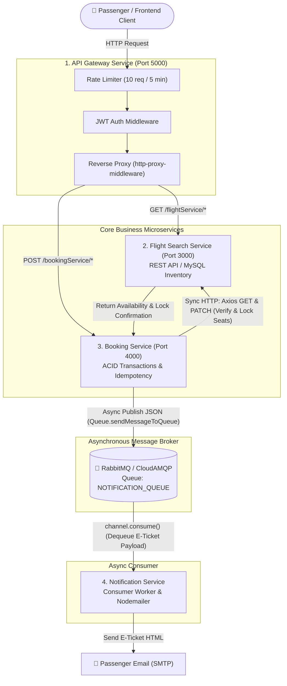

# SkyElite Microservices Architecture: Complete Communication & Integration Guide

Welcome! This document provides a clear, simple, and interview-ready explanation of how the **4 SkyElite Microservices** are structured, how they communicate with each other using **Axios (Synchronous REST)** and **RabbitMQ (Asynchronous Event-Driven Messaging)**, and the engineering decisions behind each approach.

---

## 1. The 4 Microservices Overview

Unlike traditional monolithic architectures where everything lives inside a single codebase and database, SkyElite divides responsibilities into **4 specialized microservices**:

| # | Microservice Name | Repository Path | Default Port | Key Responsibility & Stack |
|---|---|---|---|---|
| **1** | **API Gateway Service** | `Api_gateway_flights` | `5000` | Single entry point (`http-proxy-middleware`), Rate Limiting (`express-rate-limit`), and User Authentication (`jsonwebtoken` / `bcrypt`). |
| **2** | **Flight Search & Inventory Service** | `Flights_Booking_Service` | `3000` | Core flight management (`Airplanes`, `Airports`, `Cities`, `Flights`). Handles seat availability and pricing via MySQL / Sequelize. |
| **3** | **Flight Booking Service** | `Booking_Service` | `4000` | Handles passenger reservations, ACID database transactions, and **Idempotency Keys** to guarantee duplicate-free payments. |
| **4** | **Notification Service** | `Notification-Service-Flights` | `Independent` | Asynchronous worker service that listens to **RabbitMQ** and sends formatted HTML E-Ticket confirmation emails via `nodemailer`. |

---

## 2. End-to-End Architecture Diagram



---

## 3. Synchronous Communication: `Axios` (REST API)

### 📌 Where & How It Is Used
When a passenger clicks **"Book Now"**, the request hits the **Booking Service (`createBooking`)**. However, `Booking_Service` does not own the flight inventory table—`Flights_Booking_Service` does! 

To reserve seats, `Booking_Service` makes **Synchronous HTTP calls via Axios** (`src/services/booking-service.js`):

1. **Check Availability & Fare (`axios.get`):**
   ```javascript
   const flightResponse = await axios.get(`${ServerConfig.FLIGHT_SERVICE_PATH}/api/v1/flights/${data.flightId}`);
   const flightData = flightResponse.data.data;
   if (data.noOfSeats > flightData.totalSeats) {
       throw new AppError('Not enough seats available on the flight', StatusCodes.BAD_REQUEST);
   }
   ```
2. **Lock & Decrement Seats (`axios.patch`):**
   ```javascript
   await axios.patch(`${ServerConfig.FLIGHT_SERVICE_PATH}/api/v1/flights/${data.flightId}/seats`, {
       seats: data.noOfSeats,
       dec: true // Decrement remaining seats in database
   });
   ```

### 💡 Why Did We Choose Synchronous Communication Here?
* **Immediate Availability Guarantee:** A seat booking cannot be "deferred for later." If 10 seats remain and two users try to book 8 seats simultaneously, the system **must synchronously verify and lock** the exact seat count before allowing the payment to proceed.
* **ACID Transaction Bound:** If the seat decrement fails (e.g., flight sold out), the entire database transaction inside `Booking_Service` **rolls back synchronously**, preventing orphan bookings or inconsistent data.

---

## 4. Asynchronous Communication: `RabbitMQ` (`amqplib`)

### 📌 Where & How It Is Used
Once a user successfully pays (`makePayment`), the booking status changes from `INITIATED` to `BOOKED` inside an ACID transaction. At this exact moment, the passenger needs to receive their **HTML E-Ticket**.

Instead of sending the email synchronously, `Booking_Service` pushes an **asynchronous event** to **RabbitMQ** using `amqplib` (`src/config/queue-config.js`):

1. **Producer (`Booking_Service` publishes message):**
   ```javascript
   await Queue.sendMessageToQueue({
       recepientEmail: data.recepientEmail,
       subject: emailSubject,
       text: emailText,
       html: emailHtml,
       status: 'BOOKED'
   });
   // Returns instant success (<50ms response to frontend!)
   ```
2. **Consumer (`Notification-Service-Flights` dequeues message):**
   ```javascript
   channel.consume(ServerConfig.RABBITMQ_QUEUE_NAME, async (data) => {
       const object = JSON.parse(data.content.toString());
       // Send HTML E-Ticket via Nodemailer / SMTP
       await EmailService.sendEmail("airlinenoti@gmail.com", object.recepientEmail, object.subject, object.text, object.html);
       // Acknowledge the message so RabbitMQ removes it from queue
       channel.ack(data);
   });
   ```

### 💡 Why Did We Choose Asynchronous Communication Here?
* **Zero-Latency Checkout Experience:** Sending an email via external SMTP servers (like Gmail or AWS SES) takes anywhere from **1 to 5 seconds** (or can timeout). By decoupling email delivery via RabbitMQ, `Booking_Service` responds to the user instantly (**<50ms**) as soon as the database transaction commits!
* **Fault Tolerance & Reliability:** If the Gmail SMTP server goes down or slows down, `Booking_Service` is **completely unaffected**. RabbitMQ safely holds the confirmation payload in memory/disk. Once `Notification-Service-Flights` recovers or the mail server stabilizes, it processes the queued messages in order (**zero dropped notifications**).
* **Load Leveling:** If 10,000 passengers book flights during a flash sale, `Notification-Service-Flights` consumes and sends emails at a steady, controlled rate without overwhelming mail servers or triggering spam/rate limits.

---

## 5. Interview Cheat Sheet: Common Questions & Clear Answers

### Q1: *"Why did you split your project into 4 microservices instead of a Monolith?"*
> **Answer:** *"Splitting into specialized services allows **independent scaling and fault isolation**. For example, flight search (`Flights_Booking_Service`) receives **100x more traffic** than flight booking (`Booking_Service`). In a monolith, high search traffic could slow down checkout pages. With microservices, we can deploy 5 replicas of the Flight Search service while keeping just 1 or 2 replicas of the Booking and Notification services, saving cloud server costs while maximizing uptime."*

### Q2: *"How do you prevent double-booking or double-charging race conditions?"*
> **Answer:** *"We use **ACID Database Transactions combined with Idempotency Keys (`IdempotencyRepository`)**. When a client initiates a booking or payment, they pass an `idempotencyKey` in the request header/body. Our service checks `IdempotencyRepository` inside a MySQL transaction:*
> * *If the key already exists and is processing (`CONFLICT`), we block duplicate requests.*
> * *If the key already finished processing, we immediately return the cached JSON response without charging the user or decrementing seats twice."*

### Q3: *"What happens if `Flights_Booking_Service` goes down while a user is booking?"*
> **Answer:** *"Because the connection between `Booking_Service` and `Flights_Booking_Service` is **synchronous (Axios)**, if `Flights_Booking_Service` is unreachable or returns a `500 Internal Error`, `Booking_Service` catches the Axios exception and executes `await transaction.rollback()`. This guarantees that **no partial booking** is ever created in our system."*

### Q4: *"What happens if `Notification-Service-Flights` crashes or goes offline?"*
> **Answer:** *"Because the connection between `Booking_Service` and `Notification-Service-Flights` is **asynchronous (RabbitMQ)**, the booking transaction succeeds normally. RabbitMQ retains all published E-Ticket messages in durable queues (`channel.assertQueue`). When `Notification-Service-Flights` restarts (`channel.consume()`), it picks up all pending messages and sends out the emails with **zero data loss**."*

### Q5: *"Why did you build an `API Gateway` instead of having the frontend call microservices directly?"*
> **Answer:** *"An API Gateway acts as a **Single Point of Entry (`http-proxy-middleware`)** that solves three critical problems:*
> 1. ***Security & Auth Centralization:** Instead of every microservice verifying JWT tokens individually, the Gateway validates authentication centrally.*
> 2. ***Rate Limiting & DDoS Protection:** We use `express-rate-limit` (10 requests per 5 minutes per IP) at the Gateway layer to protect downstream databases from scraping or denial-of-service attacks.*
> 3. ***Decoupled Internal URLs:** The frontend only knows `http://gateway:5000`. We can change internal ports (`3000`, `4000`) or migrate microservices across different AWS instances without updating a single line of frontend code."*

---

## 6. Quick Summary Table for Interviews

| Feature / Mechanism | Technology Used | Communication Type | Why It Was Chosen |
|---|---|---|---|
| **Reverse Proxy & Routing** | `http-proxy-middleware` (API Gateway) | Synchronous HTTP | Single URL endpoint for frontend, centralized CORS/JWT security. |
| **Seat Verification & Decrement** | `Axios` (`Booking` ➔ `Flights`) | Synchronous REST | Immediate validation required; must rollback transaction if sold out. |
| **E-Ticket Email Dispatch** | `RabbitMQ` / `amqplib` (`Booking` ➔ `Notification`) | Asynchronous Queue | Zero-blocking checkout (<50ms response), fault-tolerant buffering. |
| **Payment Idempotency** | `Sequelize / MySQL` (`IdempotencyRepository`) | ACID Transaction | Prevents race conditions and duplicate credit card charges. |
