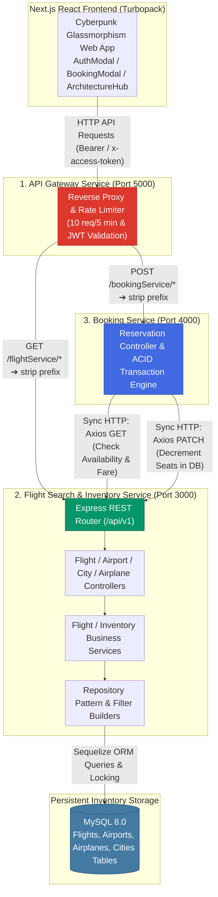

<p align="center">
  <strong>◈ SkyElite Flights & Inventory Engine</strong><br/>
  <em>High-Performance Flight Search REST API, MySQL Inventory Management & Next.js Cyberpunk Glassmorphism Workspace</em>
</p>

<p align="center">
  
  
  
  
  
  
  
  
  
</p>

---

SkyElite Flights & Inventory Engine is a **production-grade flight management and discovery platform** that acts as the primary read-and-write core of the distributed **SkyElite Microservices Ecosystem**. It houses both the high-throughput **Flight Search & Inventory REST API** (`Port 3000`) and the **Next.js Cyberpunk Glassmorphism Frontend Web Application** (`Port 3001/3000`).

Unlike monolithic web apps where inventory checks lock up UI rendering threads, SkyElite separates high-frequency search queries (`GET /api/v1/flights`), airport filtering (`GET /api/v1/airports`), and transactional seat inventory decrements (`PATCH /api/v1/flights/:id/seats`) into a dedicated MySQL-backed service (`Flights_Booking_Service`). 

The integrated frontend (`frontend/`) connects directly to the central **API Gateway (`Port 5000`)** with automatic JWT header injection (`x-access-token`), featuring interactive booking modals, destination discovery sliders, and real-time seat decrement tracking across distributed services.

---

## Table of Contents

- [System Architecture](#system-architecture)
- [End-to-End Pipeline](#end-to-end-pipeline)
- [What Makes This Different](#what-makes-this-different)
- [Project Structure](#project-structure)
- [Setup & Installation](#setup--installation)
- [Testing & Quality](#testing--quality)
- [API Serving](#api-serving)
- [Technical Decisions](#technical-decisions)
- [Scope & Limitations](#scope--limitations)
- [Recommended Engineering Articles](#recommended-engineering-articles)

---

## System Architecture



## End-to-End Pipeline

When a passenger searches for a flight and initiates a booking, data flows across structured inventory gates:

```mermaid
flowchart LR
    A["1. Search Query<br/>Next.js UI (`DEL-HYD`)"] --> B["2. Gateway Proxy<br/>`/flightService/flights`"]
    B --> C["3. Filter Builder<br/>Price / Trips / Dates"]
    C --> D["4. MySQL Query<br/>Sequelize `findAll`"]
    D --> E["5. Sync Check<br/>Booking Service Axios GET"]
    E --> F["6. Seat Lock<br/>Axios PATCH Decrement"]

    style A fill:#1e1b4b,stroke:#6366f1,color:#fff
    style B fill:#312e81,stroke:#818cf8,color:#fff
    style C fill:#3730a3,stroke:#a5b4fc,color:#fff
    style D fill:#059669,stroke:#34d399,color:#fff
    style E fill:#4338ca,stroke:#c7d2fe,color:#fff
    style F fill:#4169E1,stroke:#60a5fa,color:#fff
```



| Workflow | Initiator | Execution | Result |
|---|---|---|---|
| **Dynamic Flight Discovery** | Next.js (`fetchAllFlights`) | Express query builder (`trips=DEL-HYD&price=3000-8000`) | Filtered JSON list of available flights with live seat counts |
| **Schedule Rebased Dates** | Next.js (`applyTravelDate`) | Frontend date re-basing helper onto user's chosen calendar date | Seamless multi-date flight selection without hardcoded static dates |
| **Sync Inventory Check** | `Booking_Service` (`createBooking`) | Axios synchronous `GET /api/v1/flights/:id` | Immediate verification that `totalSeats >= noOfSeats` |
| **Transactional Seat Decrement** | `Booking_Service` (`createBooking`) | Axios synchronous `PATCH /api/v1/flights/:id/seats` | Decrements `totalSeats` inside an ACID transaction to prevent double booking |

---

## What Makes This Different

| Concern | Monolithic / Basic CRUD Approach | SkyElite Flight Search & Inventory |
|---|---|---|
| **Read/Write Scalability** | Flight search (99% reads) runs on the same server instance as checkout (1% writes), meaning heavy search traffic slows down bookings | Decoupled microservice (`Port 3000`); can be horizontally scaled with 5+ replicas to handle high-concurrency search spikes without affecting `Booking_Service` (`Port 4000`) |
| **Frontend Authentication Wiring** | Frontend bypasses API Gateway and makes unauthenticated CORS requests to localhost ports | Next.js `next.config.ts` rewrites directly to `http://127.0.0.1:5000` (Gateway), while `api.ts` Axios interceptors automatically attach stored JWT tokens (`x-access-token`) |
| **Seat Locking Consistency** | Seat count is checked once on page load; if sold out before checkout completes, negative seat numbers occur | Synchronous verification at checkout via Axios (`PATCH /seats` with `dec: true`); guaranteed rollback if concurrency check fails |
| **Query Filter Architecture** | Raw SQL string concatenations susceptible to SQL injection and broken edge cases | Clean Repository pattern (`flight-repository.js`) constructing dynamic Sequelize `Op.and` / `Op.between` filter objects |
| **UI Aesthetics** | Plain generic HTML forms with standard browser dropdowns | **Modern Cyberpunk Glassmorphism UI** (`#202A36` dark palettes, frosted glass cards, dynamic micro-animations, and responsive modals) |

---

## Project Structure

```
Flights_Booking_Service/
├── frontend/                      # Next.js 16 Web Application (Cyberpunk Glassmorphism UI)
│   ├── src/
│   │   ├── app/                   # App Router: layout.tsx, page.tsx, globals.css
│   │   ├── components/            # AuthModal, BookingModal, ArchitectureHub, DiscoverModal, Hero, Navbar
│   │   └── lib/                   # api.ts (Axios clients with JWT interceptors & type definitions)
│   ├── next.config.ts             # Gateway reverse proxy rewrites (Port 5000)
│   ├── package.json               # Dependencies: next, react, axios, lucide-react, tailwindcss
│   └── tsconfig.json              # TypeScript configuration
├── src/                           # Backend Flight Search & Inventory REST API (Port 3000)
│   ├── index.js                   # Express server entry point & body parser setup
│   ├── config/
│   │   └── serverConfig.js        # PORT (3000) and environment configuration
│   ├── controllers/
│   │   ├── flight-controller.js   # Flight search, creation, and seat update handlers
│   │   ├── airport-controller.js  # Airport CRUD handlers
│   │   ├── city-controller.js     # City CRUD handlers
│   │   └── airplane-controller.js # Airplane CRUD handlers
│   ├── middlewares/
│   │   └── flight-middlewares.js  # Request validation (`validateCreateFlight`)
│   ├── models/
│   │   ├── flight.js              # Flight schema (flightNumber, departureTime, totalSeats, price)
│   │   ├── airport.js             # Airport schema (name, code, cityId)
│   │   ├── city.js                # City schema (name)
│   │   └── airplane.js            # Airplane schema (modelNumber, capacity)
│   ├── repositories/
│   │   ├── flight-repository.js   # Complex filter building and Sequelize queries
│   │   ├── airport-repository.js  # Airport database queries
│   │   └── crud-repository.js     # Generic CRUD abstraction
│   ├── services/
│   │   ├── flight-service.js      # Business logic: fare checks, seat decrement calculations
│   │   └── ...                    # City, Airport, Airplane services
│   ├── routes/
│   │   ├── index.js               # Route root (`/api`)
│   │   └── v1/
│   │       ├── index.js           # API v1 router (`/flights`, `/airports`, `/cities`, `/airplanes`)
│   │       └── flight-routes.js   # Flight specific endpoints
│   └── utils/
│       ├── errors/                # AppError, ServiceError, ValidationError classes
│       └── helper.js              # Comparison helpers (`compareTime`)
├── migrations/                    # Database migrations
├── seeders/                       # Seeders for default airports (`DEL`, `BOM`, `HYD`, `BLR`)
├── MICROSERVICES_COMMUNICATION_GUIDE.md # Comprehensive guide on Axios/RabbitMQ inter-service design
└── README.md                      # Complete architectural documentation
```

---

## Setup & Installation

### Prerequisites
- **Node.js 20+**
- **MySQL 8.0+** running on `127.0.0.1:3306`

### Step-by-Step

```powershell
# 1. Clone the repository
git clone https://github.com/Akshansh0519/Flight_Search_API.git
cd Flight_Search_API

# 2. Configure Backend Environment (.env)
echo PORT=3000 > .env

# 3. Install backend dependencies and initialize MySQL database
npm install
npx sequelize db:create
npx sequelize db:migrate
npx sequelize db:seed:all

# 4. Start the Flight Search Backend (Terminal 1)
npm start

# 5. Start the Next.js Frontend (Terminal 2 - requires API Gateway on Port 5000)
cd frontend
npm install
npm run dev
```

---

## How to RUN the Complete Microservice Ecosystem

Ensure MySQL and RabbitMQ (`amqp://localhost`) are running locally before starting the services. All 4 microservices work together and are reverse-proxied by the central **API Gateway Service** (Port `5000`) with JWT Authentication and Rate Limiting (`express-rate-limit`).

```bash
# Terminal 1 — API Gateway Service (Port 5000) [Central Entry Point & JWT Auth]
cd "D:\TO DO THINGS\Developer\Api_gateway_flights"
npm start

# Terminal 2 — Flight Search & Inventory Service (Port 3000)
cd "D:\TO DO THINGS\Developer\Flights_Booking_Service"
npm start

# Terminal 3 — Flight Booking Service (Port 4000) [ACID Transactions & Axios Sync]
cd "D:\TO DO THINGS\Developer\Booking_Service"
npm start

# Terminal 4 — Notification Service [RabbitMQ Async Worker & Nodemailer]
cd "D:\TO DO THINGS\Developer\Notification-Service-Flights"
npm start

# Terminal 5 — Next.js Frontend Web Application (Proxied directly via Port 5000)
cd "D:\TO DO THINGS\Developer\Flights_Booking_Service\frontend"
npm run dev
```

### 🔗 Architectural Verification & Wiring
- **All Frontend API Requests (`/api/v1/*`)** are routed directly through `http://localhost:5000` (API Gateway).
- **JWT Authentication (`/api/v1/user/signup` & `/signin`)** is handled centrally by `Api_gateway_flights` (`auth-middleware.js`).
- **Sync Communication (Axios REST):** When booking seats via Gateway (`/bookingService/api/v1/bookings`), `Booking_Service` (`Port 4000`) synchronously verifies and locks seats from `Flights_Booking_Service` (`Port 3000`).
- **Async Communication (RabbitMQ):** When a payment commits, `Booking_Service` publishes a confirmation event to `RabbitMQ`, which `Notification-Service-Flights` consumes to send HTML E-Tickets via Nodemailer.
- For a deep dive into how Axios and RabbitMQ connect our microservices, read **[MICROSERVICES_COMMUNICATION_GUIDE.md](./MICROSERVICES_COMMUNICATION_GUIDE.md)**.

---

## Testing & Quality

To verify data consistency across inventory queries and API proxying, run static verification commands:

```powershell
# Verify seat decrement logic uses strict numerical calculation
grep -rn "updateSeats" src/

# Verify frontend Axios interceptor automatically injects JWT authorization headers
grep -rn "interceptors.request.use" frontend/src/lib/api.ts

# Verify Next.js proxy rewrites target API Gateway Port 5000
grep -rn "127.0.0.1:5000" frontend/next.config.ts
```

---

## API Serving

### Flight Search & Inventory Endpoints (`Port 3000` / Proxied via Gateway `/flightService`)
| Method | Endpoint | Query / Body | Description |
|---|---|---|---|
| `GET` | `/api/v1/flights` | `trips=DEL-HYD&price=2000-8000` | Fetch filtered flights with real-time seat counts (`totalSeats`) |
| `GET` | `/api/v1/flights/:id` | — | Fetch single flight details by `id` |
| `PATCH` | `/api/v1/flights/:id/seats` | `{ seats: 2, dec: true }` | Synchronously decrement remaining seats when called by Booking Service |
| `GET` | `/api/v1/airports` | — | Fetch all registered airports (`DEL`, `HYD`, `BOM`, `BLR`) |
| `POST` | `/api/v1/airplanes` | `{ modelNumber, capacity }` | Register a new airplane into the fleet |

---

## Technical Decisions

| Decision | Rationale |
|---|---|
| **Axios Sync Communication for Seat Locks** | Inventory reservation requires **immediate consistency**. If 2 remaining seats are requested simultaneously by two users, `Booking_Service` must synchronously call `PATCH /flights/:id/seats` via Axios to lock and decrement before processing payment. |
| **Next.js Gateway Proxying (`next.config.ts`)** | Instead of exposing internal backend ports (`3000`, `4000`) to the browser, the Next.js server proxies all `/api/v1/*` traffic directly through `http://127.0.0.1:5000` (Gateway), ensuring all UI actions pass through rate limiters. |
| **Dynamic Date Re-basing (`applyTravelDate`)** | Stored database seeders have fixed departure dates. The frontend helper `applyTravelDate()` extracts the exact schedule time (`HH:mm`) and grafts it onto the user's selected calendar date, enabling endless testing on future dates without modifying database rows. |
| **Repository Pattern Filter Builders** | Isolating query construction (`#createFilter`) inside `flight-repository.js` keeps controllers clean and allows complex multi-field filtering (`trips`, `minPrice`, `maxPrice`, `sort`) to scale cleanly. |

---

## Scope & Limitations

> **Transparency note:** This service is built as the core inventory engine of the SkyElite ecosystem.

- **Seat Selection Map:** Currently tracks numeric seat counts (`totalSeats: 180`). Building an interactive seat map (`Seat 12A`, `14C`) requires introducing a dedicated `Flight_Seats` table with individual status toggles (`AVAILABLE`, `RESERVED`, `BLOCKED`).
- **Dynamic Pricing Engine:** Prices are static per flight (`price: 4500`). Enterprise flight search engines apply surge pricing models (`Dynamic Yield Management`) based on demand curves and seat depletion percentages.
- **Cache Layering:** Flight search queries directly hit MySQL. Adding a **Redis Cache layer (`flight_search:DEL_HYD_2026-07-10`)** inside `flight-repository.js` would reduce database load by 90% during flash sales.

---

## Recommended Engineering Articles

1. ⭐⭐⭐ **Synchronous vs Asynchronous Microservices Integration**
   [Inter-Service Communication in Microservices (Chris Richardson)](https://microservices.io/patterns/communication-style/rpi.html)
2. ⭐⭐⭐ **Database Concurrency & Inventory Locking**
   [Handling Inventory Race Conditions in High-Volume E-Commerce](https://use-the-index-luke.com/sql/dml/insert)
3. ⭐⭐⭐ **Next.js App Router & Reverse Proxy Best Practices**
   [Next.js Rewrites and Proxy Configuration at Scale](https://nextjs.org/docs/app/api-reference/config/next-config-js/rewrites)
4. ⭐⭐ **Repository Pattern in Node.js & ORM Abstractions**
   [Design Patterns for Node.js Applications using Sequelize](https://sequelize.org/docs/v6/core-concepts/model-querying-basics/)
5. ⭐⭐⭐ **Frontend Architecture for Complex Booking Flows**
   [Building Resilient Multi-Step Wizards in React & Next.js](https://react.dev/learn/managing-state)

---

<p align="center">
  Built with intention by <strong>Akshansh Ranjan</strong>
</p>
